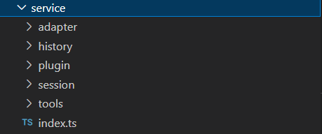
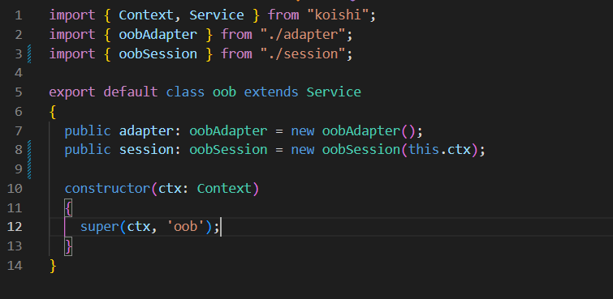
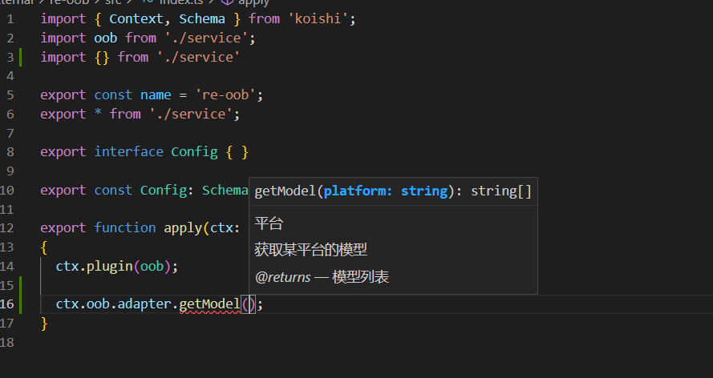

# koishi-plugin-re-oob

[](https://www.npmjs.com/package/koishi-plugin-re-oob)

# 入门

首先创建一个oob服务，koishi的服务是一个类。这个服务类内包含以下内容：



|index.ts|oob服务类|
|--|--|
|adapter|平台适配器（平台指OpenAI这样的平台）|
|history|消息历史缓存|
|session|聊天事件|
|tools|基础工具|

## Adapter（平台适配器）

平台适配器是一个对象，大概是这样的：

```
Adapter: {
  platform: string;
  modules: string[];
  config: any;
}
```

|pushAdapter(adapter:Adapter) => void|注册一个平台|
|--|--|
|getAdapterList() => string[]|获取所有的适配器列表|
|getModel(platform:string) => strig[]|通过适配器的名字查询对应的模型|
|getModelList() => string[]|获取所有模型（返回的字符串元素是：[platform:model,platform:model]）|
|getAdapterConfig(platform:string)=>Adapter.config|通过适配器名字查询对应的配置|

## History（消息历史）

正在施工...

## session（聊天事件）

聊天事件是用于注册类似原先oob的表情包等功能的东东。

我看了一下下原先oob的code，大概抓取了几个时间点，

第一个时间点是`触发聊天的oob指令`之后，`把信息传入聊天的大模型进行处理`之前。（完成图形理解之类的工作）

第二个时间点是`信息传入聊天大模型进行处理，并且处理完成`之后，`把完成的结果发送出去`之前。（完成表情包之类的工作）

第三个时间点是`发送完成的结果`之后。（完成发送为语音，保存到记忆库什么的）

我希望将图形理解之类的单独作为插件来编写，从而使得配置项可以下方到各个子插件，用户可以按需安装需要的插件。

我尝试使用koishi的事件系统，定义了以下三个事件：

|oob/session/beginChat|第一个时间点|
|--|--|
|oob/session/beforeChat|第二个时间点|
|oob/session/beforSend|第三个时间点|

通过监听上述三个时间点的事件来完成表情包发送之类的事情。

## Tools（基础工具）

正在施工...

这个里面包含一些比如是读写数据库，创建随机数之类的工具函数

## 服务类

Adapter，Session，History，Tools之类的都是类而不是函数集）我希望能够因为这样的设计而使得整个插件可以复用。最终的oob服务类大概是这样的：



能够直接通过ctx.oob来访问adapter等模块内的方法


